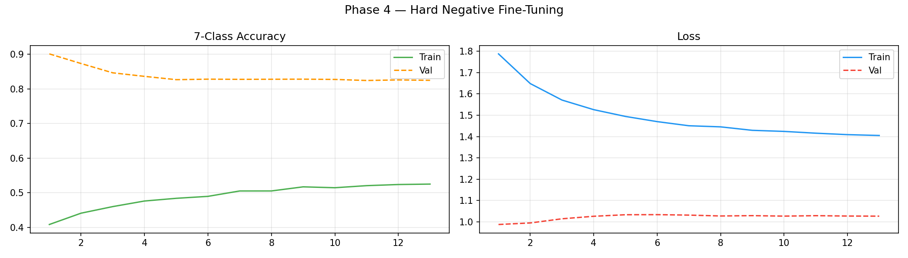
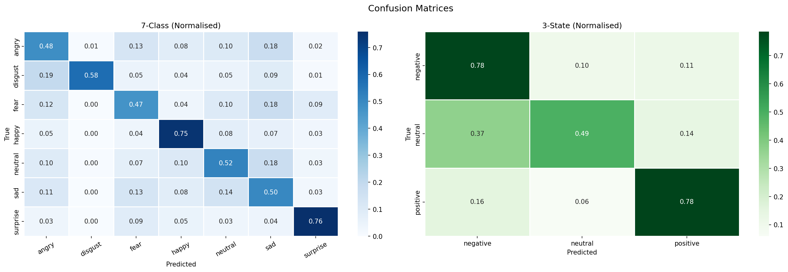
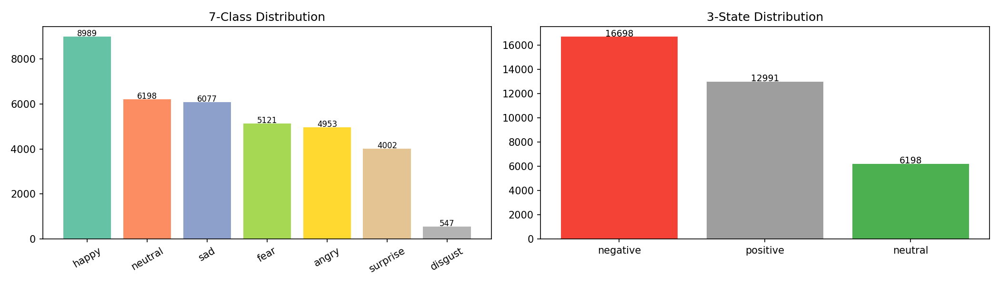

# MindSight — Multimodal AI Mental Health Analysis System

> **Author:** Bhagyajyoti-123  
> **Last Updated:** 2026-08-26 07:48:38  
> **Repository:** Bhoomika-Baloorgi/MindSight-Multimodal-AI

---

## What is MindSight?

MindSight is an end-to-end multimodal AI system that analyses a
person's emotional and mental state by combining signals from four
different sources — **face**, **voice**, **text**, and **behaviour** —
and produces a fused emotion prediction along with a personalised
AI-generated mental health insight report.
Face Image ──(0.40)──┐
Audio File ──(0.30)──┤──► Weighted Fusion ──► Emotion + State
Text Input ──(0.20)──┤ │
Behaviour ──(0.10)──┘ ▼
AI Report (Groq LLaMA3 8B)

---

## Models

### 1. Face Emotion Model — MobileNetV2

| Property      | Detail                                        |
|---------------|-----------------------------------------------|
| Architecture  | MobileNetV2 (pretrained on ImageNet)          |
| Input         | 96 × 96 RGB face image                        |
| Output 1      | 7-class emotion probabilities                 |
| Output 2      | 3-state sentiment (negative/neutral/positive) |
| Face Embedding| 1280-d GlobalAvgPool (for fusion)             |
| Training      | 4-phase transfer learning                     |

**Training Phases:**
1. Phase 1 — Backbone frozen, train head only (25 epochs)
2. Phase 2 — Unfreeze top 30 layers, fine-tune (40 epochs)
3. Phase 3 — Balanced resampling, 3000 samples/class (40 epochs)
4. Phase 4 — Hard-negative mining, neutral reduced to 1500 (30 epochs)

**Datasets:**
- FER2013 — 35,887 grayscale images, 7 emotions (Kaggle)
- RAF-DB — 15,339 real-world RGB face images (Kaggle)
- Personal images — custom collected, augmented 8×

**Key fix applied:** Neutral class was over-predicted (bias).
Fixed by capping neutral at 1500 samples and boosting
negative emotions (angry/disgust/fear/sad) to 3500 each.

---

### 2. Text Emotion Model — BERT

| Property     | Detail                                        |
|--------------|-----------------------------------------------|
| Architecture | bert-base-uncased (HuggingFace, fine-tuned)   |
| Input        | Raw text string (max 128 tokens)              |
| Output       | 7-class emotion probabilities                 |
| Fallback     | sklearn text_model.pkl + text_vectorizer.pkl  |
| Dataset      | Custom 75k text dataset                       |

**How it works:**
1. Text is tokenised using BERT WordPiece tokenizer
2. Passed through 12 transformer layers
3. [CLS] token representation → classification head
4. Softmax over 7 emotion classes

---

### 3. Behavioural Model — Random Forest

| Property     | Detail                                        |
|--------------|-----------------------------------------------|
| Architecture | Random Forest (sklearn)                       |
| Input        | 12 lifestyle features                         |
| Output       | Stress level: high / medium / low             |
| Mapping      | Stress level → emotion probability vector     |
| Dataset      | Screen time + mental wellness dataset         |

**12 Input Features:**

| Feature                    | Range  | Description              |
|----------------------------|--------|--------------------------|
| age                        | 10-100 | User age                 |
| gender                     | 0-2    | 0=F, 1=M, 2=Other        |
| occupation                 | 0-3    | Student/Employed/etc     |
| work_mode                  | 0-3    | Remote/Office/Hybrid/NA  |
| screen_time_hours          | 0-24   | Total daily screen time  |
| work_screen_hours          | 0-24   | Work/study screen time   |
| leisure_screen_hours       | 0-24   | Social media/video time  |
| sleep_hours                | 0-12   | Last night's sleep       |
| sleep_quality_1_5          | 1-5    | Self-rated sleep quality |
| productivity_0_100         | 0-100  | Self-rated productivity  |
| exercise_minutes_per_week  | 0-1000 | Weekly exercise          |
| social_hours_per_week      | 0-100  | Weekly social time       |

**Stress → Emotion Mapping:**

| Stress Level | Angry | Disgust | Fear | Happy | Neutral | Sad  | Surprise |
|--------------|-------|---------|------|-------|---------|------|----------|
| high         | 0.25  | 0.15    | 0.20 | 0.05  | 0.10    | 0.20 | 0.05     |
| medium       | 0.10  | 0.08    | 0.10 | 0.15  | 0.30    | 0.15 | 0.12     |
| low          | 0.05  | 0.03    | 0.05 | 0.30  | 0.30    | 0.05 | 0.22     |

---

### 4. Audio Model — WavLM *(integrated)*

| Property     | Detail                                        |
|--------------|-----------------------------------------------|
| Architecture | WavLM Large (Microsoft, fine-tuned PyTorch)   |
| Input        | Raw audio waveform (16kHz mono)               |
| Output       | 7-class emotion probabilities                 |
| Datasets     | TESS + RAVDESS + CREMA-D                      |
| File         | best_wavlm_ser_v2.pt (1.06 GB, Google Drive)  |

**Why WavLM?**
WavLM was pretrained on 94k hours of speech using masked speech
prediction. It captures rich acoustic features including prosody,
pitch, energy and speaker characteristics — making it far superior
to YAMNet for speech emotion recognition.

---

## Emotion Classes

| Index | Emotion  | State    | Emoji |
|-------|----------|----------|-------|
| 0     | angry    | negative | 😠   |
| 1     | disgust  | negative | 🤢   |
| 2     | fear     | negative | 😨   |
| 3     | happy    | positive | 😊   |
| 4     | neutral  | neutral  | 😐   |
| 5     | sad      | negative | 😢   |
| 6     | surprise | positive | 😲   |

---

## Fusion Architecture
Face (1280-d embedding) ──┐ weight=0.40
Audio (7-d proba) ──┤ weight=0.30 Weighted
Text (7-d proba) ──┤ weight=0.20 Average ──► 7-d fused proba
Behav (7-d proba) ──┘ weight=0.10 Fusion ──► argmax ──► emotion
──► mapping ──► state

**Weight Renormalisation:**
When a modality is skipped, its weight is redistributed
proportionally among active modalities.

Example: if audio is skipped:
- Face  = 0.40/(0.40+0.20+0.10) = 0.571
- Text  = 0.20/(0.40+0.20+0.10) = 0.286
- Behav = 0.10/(0.40+0.20+0.10) = 0.143

---

## AI Report Generation

Uses **Groq API** (free, 400 tokens/second) with LLaMA3 8B model.

**Report Structure:**
1. **What We Detected** — emotion and confidence explained simply
2. **Your Signals** — what each modality revealed and if they agreed
3. **Mental Health Insight** — meaningful wellness insight
4. **Suggested Actions** — 3 specific actionable things to do now

**Fallback:** Rule-based report if API key not set.

---

## How to Run

1. Open `notebooks/MindSight_Analysis_v2.ipynb` in Google Colab
2. Runtime → Change runtime type → **T4 GPU**
3. Run **Cell 0** — installs packages
4. Run **Cell 1** — config (set your Groq API key here)
5. Run **Cells 2-7** — loads all models
6. Run **Cell 8** — starts analysis
7. Follow prompts:
   - Upload face photo (file explorer opens)
   - Type how you feel
   - Answer 12 lifestyle questions
   - Upload audio file (optional)
8. Receive emotion prediction + mental health insight report

**Get free Groq API key:** https://console.groq.com

---

## Project Structure
MindSight-Multimodal-AI/
├── notebooks/
│ ├── MindSight_Analysis_v2.ipynb ← MAIN (run this)
│ ├── MindSight_Analysis.ipynb ← Previous version
│ ├── Face_Emotion_MobileNetV2_v2.ipynb
│ ├── IntegrationModel.ipynb
│ ├── BERT_final.ipynb
│ └── MindSight_ULTIMATE.ipynb
├── models/
│ └── face_model/
│ ├── label_encoder_7.pkl
│ ├── label_encoder_3.pkl
│ ├── class_names.json
│ ├── confusion_matrices.png
│ ├── training_history_phase4.png
│ └── dataset_distribution.png
├── docs/
│ ├── PROJECT_OVERVIEW.md ← This file
│ ├── last_updated.txt
│ └── images/
│ ├── confusion_matrices.png
│ ├── training_history_phase4.png
│ └── dataset_distribution.png
├── Audio_Model.ipynb
├── BERT_Text_Model.ipynb
├── Balanced_FER_model.ipynb
├── MODELS.md
└── .gitignore

---

## Models on Google Drive

MyDrive/MindSight_Models/
├── facial_model.keras Face model v1
├── voice_model.keras Voice model
├── bert_text_model/ BERT weights + tokenizer
├── text_model.pkl Sklearn text fallback
├── text_vectorizer.pkl
├── behavioral_model.pkl Behaviour RF model
├── behavioral_columns.json
├── behavioral_labels.json
└── best_wavlm_ser_v2.pt WavLM audio (1.06 GB)

MyDrive/Emotion_Project/face_model/exports/
├── face_emotion_model.keras Face model v2 (best)
├── face_embedding_extractor.keras
├── label_encoder_7.pkl
└── label_encoder_3.pkl

---

## Future Plans

- [ ] Replace questionnaire with automatic phone sensor data
- [ ] Flutter mobile app with real-time camera + microphone
- [ ] Longitudinal mood tracking over time
- [ ] Attention-based fusion (learn weights automatically)
- [ ] Multi-person support with privacy encryption
- [ ] Clinical validation study

---

## Contributors

- **Bhoomika-Baloorgi** — Project lead, model architecture
- **Bhagyajyoti-123** — Integration, face model, documentation
- **Bhavana-PK** — Collaborator
- **Chandana-S06** — Collaborator
